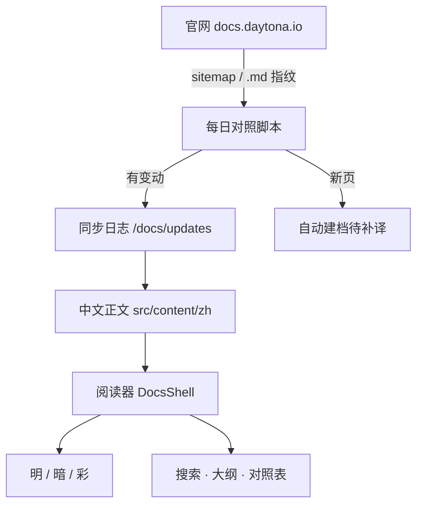
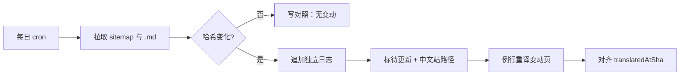

# 本站架构 {#architecture-site}

本站是 Daytona 官方文档的中文阅读器，不是 Daytona 产品本身。产品架构见 [架构](/docs/architecture)。

## 阅读器 {#reader}

- 正文在 `src/content/zh/**/*.md`，标题可带 `{#english-id}` 对齐官网锚点。
- 侧栏目录由 `src/lib/docs/catalog.ts` 生成，路径与官网 `/docs/en/...` 对齐（本站去掉 `en/`）。
- 渲染器支持标题、列表、表格、代码、引用、Mermaid。
- 顶栏可切明 / 暗 / 彩，结果存在浏览器本地。

## 同步如何驱动永久汉化 {#sync}

1. GitHub Actions 每天对照官网 Markdown 哈希。
2. 有新增 / 修改 / 删除就在 [/docs/updates](/docs/updates) **新增一条日志**，每条写明 `webPath`（中文站位置）。
3. 新增页面会自动建档，正文标「待补」。
4. 译完后用 `npm run sync:docs -- --mark-translated <slug>` 把指纹标回一致。
