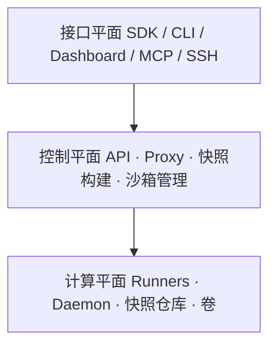

# 架构 {#architecture}

Daytona 平台分成三个平面，各司其职：

- [接口平面](#interface-plane)：用户和智能体访问 Daytona 的客户端
- [控制平面](#control-plane)：编排全部沙箱操作
- [计算平面](#compute-plane)：真正跑沙箱实例

### 接口平面 {#interface-plane}

接口平面提供用户和智能体访问 Daytona 的客户端，对所有用户和智能体开放：

- **SDK**：[Python](/docs/python-sdk)、[TypeScript](/docs/typescript-sdk)、[Ruby](/docs/ruby-sdk)、[Go](/docs/go-sdk)、[Java](/docs/java-sdk)
- [CLI](/docs/tools/cli)：命令行直接操作沙箱
- [Dashboard](https://app.daytona.io/dashboard/)：网页里管理与监控沙箱
- [MCP](/docs/mcp)：给 AI 工具用的 Model Context Protocol 服务器
- [SSH](/docs/ssh-access)：连进正在跑的沙箱

### 控制平面 {#control-plane}

控制平面是 Daytona 的中枢。它接收全部客户端请求，管理沙箱完整生命周期，把沙箱调度到 runner 上，并持续对账基础设施状态。包含：

- [API](#api)：认证、沙箱生命周期、资源分配
- [Proxy](#proxy)：把外部流量路由进沙箱
- [快照构建器](#snapshot-builder)：构建和管理[快照](/docs/snapshots)
- [沙箱管理器](#sandbox-manager)：生命周期与状态对账

#### API {#api}

API 是基于 NestJS 的 REST 服务，是平台操作的主入口：认证、沙箱生命周期、快照、卷、资源分配。快照构建器和沙箱管理器作为 API 内部进程运行。内部还会用到：

- **Redis**：缓存、会话、分布式锁
- **PostgreSQL**：元数据与配置的主存储
- **Auth0 / OIDC**：用 OpenID Connect 认证用户和服务。组织也可以用自己的 OIDC 身份提供商配 [SSO](/docs/sso)。API 按组织做多租户：每个沙箱、快照、卷都属于一个组织，访问控制打在组织边界上
- **SMTP**：组织邀请、账号通知、告警邮件
- [沙箱管理器](#sandbox-manager)：把沙箱调度到 runner，对账状态，执行生命周期策略
- **PostHog**：平台分析与用量指标

从 API 操作沙箱，见 [API](/docs/tools/api) 与 [Toolbox API](/docs/tools/api#daytona-toolbox)。

#### 代理 {#proxy}

专用 HTTP 代理，按主机名把外部流量路由到正确沙箱。每台沙箱的地址是 `{port}-{sandboxId}.{proxy-domain}`，端口对应沙箱里跑的服务。代理会解析目标 runner、注入认证头再转发。支持 HTTP 和 WebSocket。

#### 快照构建器 {#snapshot-builder}

快照构建器跑在 API 进程里，从 Dockerfile 或[容器镜像仓库](#container-registry)里的预构建镜像编排[快照](/docs/snapshots)。它协调 runner 构建或拉取镜像，再推到内部、实现 OCI 分发规范的快照仓库。

#### 沙箱管理器 {#sandbox-manager}

同样跑在 API 进程里：把沙箱调度到 runner、对账状态、执行[沙箱生命周期](/docs/sandboxes#sandbox-lifecycle)策略。

### 计算平面 {#compute-plane}

计算平面是沙箱真正跑起来的基础设施。沙箱跑在 [runner](#sandbox-runners) 上——一台 runner 可以托管多台带独立资源的沙箱，并在共享或专属[区域](/docs/regions)里横向扩展。组成：

- [沙箱 Runner](#sandbox-runners)：托管沙箱
- [沙箱守护进程](#sandbox-daemon)：沙箱内部的代码执行与环境访问
- [快照仓库](#snapshot-store)：存快照镜像
- [卷](#volumes)：跨沙箱共享的持久存储

#### 沙箱 Runner {#sandbox-runners}

Runner 是计算平面的计算节点。每台 runner 向控制平面 API 拉任务，执行创建、启动、停止、销毁、调整大小、备份。它们对接 S3 兼容对象存储（快照和卷数据）以及内部快照仓库。

每台沙箱都是隔离实例：独立的进程、网络、文件系统挂载和 IPC 命名空间。Runner 为每台沙箱分配专用 vCPU、内存和磁盘。

#### 沙箱守护进程 {#sandbox-daemon}

守护进程跑在每台沙箱内部，暴露 [Toolbox API](/docs/tools/api#daytona-toolbox)：文件系统、Git、进程与代码执行、计算机使用、日志流、终端会话。

#### 快照仓库 {#snapshot-store}

内部 OCI 兼容仓库，按 OCI 分发规范存快照镜像。创建新沙箱时 runner 从这里拉镜像。后端是 S3 兼容对象存储。

#### 卷 {#volumes}

[卷](/docs/volumes)提供可跨沙箱共享的持久存储。每个卷由 S3 兼容对象存储 backing，以可读写目录挂进沙箱。多台沙箱可以同时挂同一卷，数据独立于沙箱生命周期。

### 容器镜像仓库 {#container-registry}

创建沙箱或构建快照时，可以从公开或私有 OCI 仓库拉镜像。私有仓库凭证按组织配置。也可用[声明式构建](/docs/declarative-builder)在代码里描述镜像。

> 英文原文：https://www.daytona.io/docs/en/architecture
> 本站位置：`/docs/architecture`
